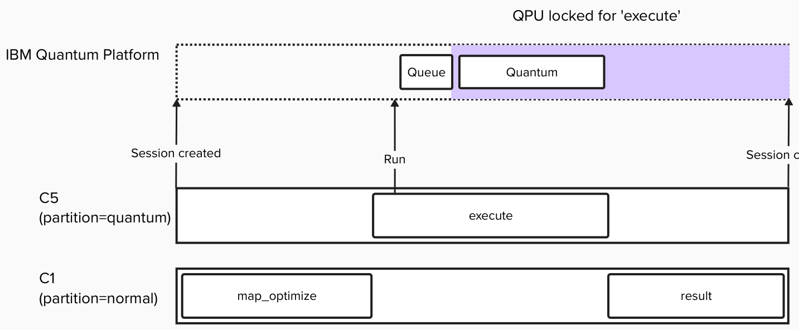
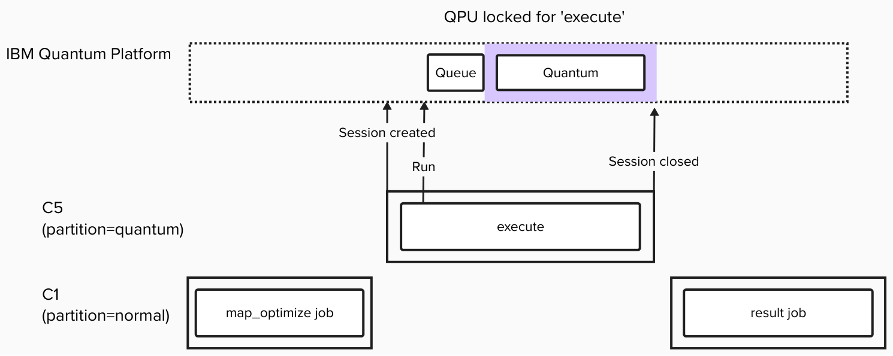

# Splitting a job

Here, we modify the Qiskit Sampler program used in [Getting Started](../getting_started/README.md), split it into three tasks, and execute them.

After creating (Map) and transpiling (Optimize) the quantum circuit, the serialized primitive input is written to a file. The task_runner is provided by the QRMI Python library, which takes the primitive input, executes the quantum job, and writes the result to a file. That result file is then parsed and converted into a PrimitiveResult (Result), which is printed to standard output.

Two execution methods are provided: using Slurm’s heterogeneous job feature, and running three separate sbatch jobs sequentially as independent tasks.

Below is the Slurm script for the heterogeneous job. It defines two components: 
- a CPU node (node=c1, partition=normal) and
- a quantum computation node (node=c5, partition=quantum).

The Map/Optimize and Result tasks run on the CPU node, while the Execute task runs on the quantum computation node.

```bash
#!/bin/bash

#SBATCH --qpu=ibm_fez
#SBATCH --job-name=job_split_hetjob
#SBATCH --ntasks=1
#SBATCH --cpus-per-task=1
#SBATCH --partition normal

#SBATCH hetjob

#SBATCH --gres=qpu:1
#SBATCH --qpu=ibm_fez
#SBATCH --partition quantum

echo "Starting at `date`"
echo "Running on hosts: $SLURM_NODELIST"
echo "Running on $SLURM_NNODES nodes."
echo "Running $SLURM_NTASKS tasks."
echo "Current working directory is `pwd`"

# Your script goes here
source /shared/pyenv/bin/activate
srun --het-group=0 python map_optimize.py
srun --het-group=1 task_runner ibm_fez sampler_input_ibm_fez.json sampler_output_ibm_fez.json
srun --het-group=0 python result.py sampler_output_ibm_fez.json
```

When running with QRMI for the IBM Qiskit Runtime Service, the quantum job is executed on the IBM Quantum Platform using Qiskit Runtime’s [Session](https://quantum.cloud.ibm.com/docs/en/guides/execution-modes#session-mode) execution mode by default. That is, once the resource is allocated and the job starts, a Qiskit session is created(```acquire()```); after the first Sampler.run() call, the QPU is exclusively occupied. The session is closed when the Slurm job finishes(```release()```). In other words, the QPU remains locked until the Slurm job completes. Sessions run in dedicated mode, which means that the user has total access to the backend. Sessions are never interrupted by calibrations or software upgrades.



To minimize QPU occupancy time on the cloud side, one approach is to split the Slurm job. By running the three tasks as independent Slurm jobs, the QPU lock is released when the Execute task finishes, allowing the cloud system to run the next job. However, since three separate Slurm jobs are submitted, there will be queue-related latency until each job is scheduled and starts executing.

```bash
jobidA=$(sbatch --parsable ./map_optimize.sh)
echo $jobidA
jobidB=$(sbatch --parsable --dependency=afterok:$jobidA ./execute.sh)
echo $jobidB
jobidC=$(sbatch --parsable --dependency=afterok:$jobidB ./result.sh)
echo $jobidC
```


